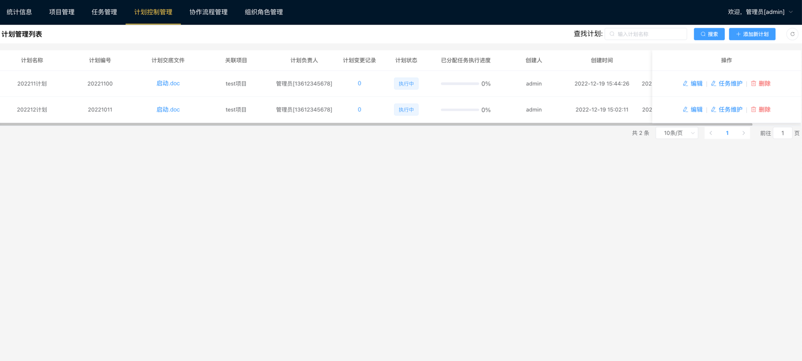
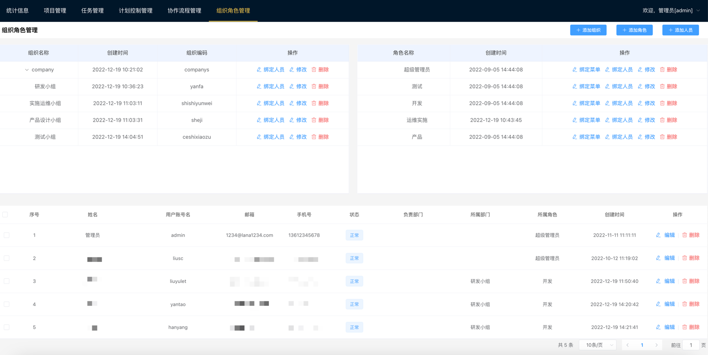

# lana-web
努努力搞一个自定义审批的oa
表单设计器与自定义流程目前整子啊整合中.....
表单设计器整合了@JakHuang https://github.com/JakHuang/form-generator 并进行修改.

# 现应用场景：
目前用于研发团队中的进度安排，创建计划--创建任务，并绑定执行流程，用来需求、研发、测试、实施、运维人员的任务安排、执行结果留存、执行计划把控。

# 后续计划1：
整合微信通知、邮箱通知、有条件的话就整合短信通知。让任务的及时性通知能够到使用人员面前

## 项目设置与使用
```
编译：
yarn install

用于开发的编译和热加载：
yarn run serve

用于生产的编译和缩减：
yarn run build
打包有问题？就试试 npm run build:dev（分支名称）

Lints和修复文件：
yarn run lint
```
# 1.0 基础特性
1. 项目管理;
2. 任务管理;
3. 计划控制管理;
4. 协作流程管理;
5. 组织角色管理;

# 截图







